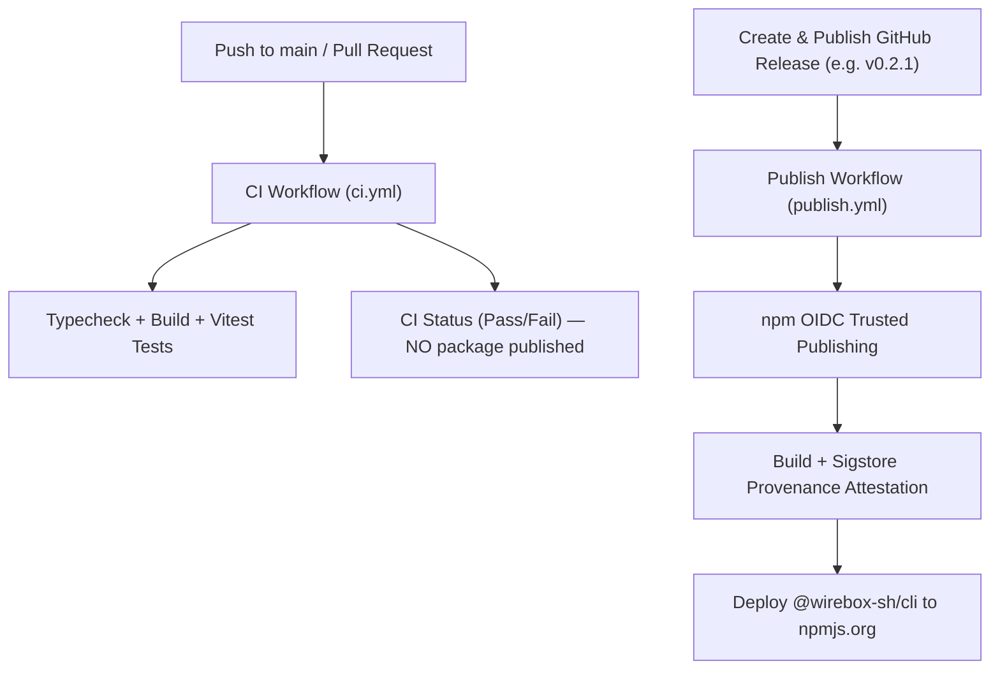

# AGENTS.md

> Guidance and instructions for AI coding agents working on the **`wirebox-cli`** codebase (`@wirebox-sh/cli`).

---

## 1. Project Overview

`wirebox-cli` is the official Command Line Interface (CLI) for **Wirebox** — equipping autonomous agents and developers with real-world identities, email inboxes, network tunnels, and webhooks from the terminal.

- **npm Package**: [`@wirebox-sh/cli`](https://www.npmjs.com/package/@wirebox-sh/cli)
- **Binary Command**: `wirebox`
- **GitHub Remote**: `git@github.com:wirebox-sh/wirebox-cli.git`
- **Primary Stack**: TypeScript 5+, Commander.js, `tsup`, `vitest`
- **Primary Dependency**: [`@wirebox-sh/sdk`](https://www.npmjs.com/package/@wirebox-sh/sdk)

---

## 2. Directory Structure

```text
wirebox-cli/
├── .github/
│   └── workflows/
│       ├── ci.yml              # CI: Typecheck, build, vitest tests on push/PR to main
│       └── publish.yml         # Release: npm OIDC Trusted Publishing on GitHub Release
├── src/
│   ├── index.ts                # Executable entrypoint (#!/usr/bin/env node)
│   ├── client.ts               # Wirebox SDK client factory and CLI_VERSION constant
│   ├── errors.ts               # CLI user-facing error formatting
│   ├── output.ts               # Table, key-value, and JSON formatting helpers
│   ├── commands/
│   │   ├── whoami.ts           # wirebox whoami / me
│   │   ├── signup.ts           # wirebox signup / verify (autonomous onboarding)
│   │   ├── identity.ts         # wirebox identity (create, list, get, delete)
│   │   ├── mail.ts             # wirebox mail (list, send, read, reply)
│   │   ├── imessage.ts         # wirebox imessage (chat, send, reply)
│   │   ├── tunnel.ts           # wirebox tunnel (list, get, connect, forward)
│   │   ├── webhook.ts          # wirebox webhook (list, create, ping, rotate-secret)
│   │   └── connect.ts          # wirebox connect (phone iMessage/SMS/email -> local agents)
│   └── connect/                # Agent Connect runtime & drivers
│       ├── drivers/            # Claude Code, Hermes, OpenAI Codex, OpenCode
│       ├── core/               # Tunnel listener, session manager, prompt framer
│       ├── daemon/             # macOS launchd background service
│       └── ui/                 # Doctor, interactive wizard, use-case simulation
├── tests/                      # Vitest test suites (47+ tests)
├── package.json                # Package metadata, bin definition, and dependencies
├── tsup.config.ts              # ESM bundle configuration
└── tsconfig.json               # TypeScript configuration
```

---

## 3. Development Commands

Always run commands inside the `wirebox-cli/` directory:

| Task | Command | Purpose |
| :--- | :--- | :--- |
| **Typecheck** | `npm run typecheck` | Run static type checking (`tsc --noEmit`) |
| **Build** | `npm run build` | Bundle standalone ESM binary to `dist/index.js` |
| **Test** | `npm test` | Run all Vitest CLI unit tests |
| **Local Binary Test** | `node dist/index.js --version` | Verify the built binary reports the correct version |
| **Local CLI Help** | `node dist/index.js --help` | Verify all CLI subcommands and options render |

---

## 4. Version Management Policy & Synchronization Points

The CLI follows **Semantic Versioning (SemVer)**: `MAJOR.MINOR.PATCH`.

⚠️ **CRITICAL: Multiple Synchronization Points**:
When updating the CLI version, you **MUST** synchronize the following locations together:

1. **[`package.json`](package.json)**:
   - Update `"version": "<x.y.z>"`.
   - Ensure `"bin"` path uses the bare relative path `"wirebox": "dist/index.js"`.
     > ⚠️ **DO NOT USE** `"./dist/index.js"`: npm 11+ path normalization strips paths starting with `./` during publish and outputs a warning.
2. **[`package-lock.json`](package-lock.json)**:
   - Keep lockfile in sync by running `npm install --package-lock-only`.
3. **[`src/client.ts`](src/client.ts)**:
   - Update `export const CLI_VERSION = "<x.y.z>";`.
   - This constant is returned by `wirebox --version` and passed as client telemetry during tunnel handshakes.
4. **[`src/commands/tunnel.ts`](src/commands/tunnel.ts)**:
   - Tunnel connections report client telemetry formatted as ``wirebox-cli/${CLI_VERSION}``.

---

## 5. Ecosystem Dependency Sequencing

`@wirebox-sh/cli` depends on [`@wirebox-sh/sdk`](https://www.npmjs.com/package/@wirebox-sh/sdk).

⚠️ **CRITICAL RELEASE ORDER**:
Whenever new features in the core API or SDK are introduced (e.g. webhooks or tunnels):
1. **First**: Bump, test, and publish `@wirebox-sh/sdk` to npm.
2. **Second**: Verify `@wirebox-sh/sdk` is live on npm (`npm view @wirebox-sh/sdk version`).
3. **Third**: Update `wirebox-cli/package.json` to depend on the new SDK version:
   ```json
   "dependencies": {
     "@wirebox-sh/sdk": "^<new-sdk-version>",
     "commander": "^13.1.0"
   }
   ```
4. **Fourth**: Run `npm install` inside `wirebox-cli` to update `package-lock.json`.
5. **Fifth**: Run `npm test && npm run build` and release `@wirebox-sh/cli`.

*Attempting to release the CLI before the required SDK version is live on npm will cause CI (`npm ci`) to fail.*

---

## 6. CI/CD & npm Release Workflow



### 6.1 Why Pushing to `main` Does NOT Publish
- Pushes to `main` trigger **only** [`.github/workflows/ci.yml`](.github/workflows/ci.yml).
- Publishing is gated exclusively on creating a **GitHub Release**.

### 6.2 npm Trusted Publishing (OIDC)
- The package uses npm **Trusted Publishing** (OpenID Connect).
- No long-lived `NPM_TOKEN` secret is stored in the repository.
- Workflow requirements:
  - Runner uses Node 22 with `npm install -g npm@latest` (npm >= 11.5.1 required).
  - No `registry-url` passed to `actions/setup-node`.
  - Cryptographic provenance signed via Sigstore transparency logs.

### 6.3 Step-by-Step Release Guide

To release a new CLI version to npm:

1. **Synchronize Version**:
   - Update version in [`package.json`](package.json).
   - Update `CLI_VERSION` in [`src/client.ts`](src/client.ts).
   - Run `npm install --package-lock-only` to update `package-lock.json`.

2. **Verify Locally**:
   ```bash
   npm run build && npm test && npm run typecheck
   node dist/index.js --version
   node dist/index.js --help
   ```

3. **Commit and Push to `main`**:
   ```bash
   git add package.json package-lock.json src/client.ts
   git commit -m "chore(release): bump version to <x.y.z>"
   git push origin main
   ```
   Wait for CI to pass on GitHub Actions.

4. **Trigger Release via GitHub CLI**:
   ```bash
   gh release create v<x.y.z> --title "v<x.y.z>" --notes "<release description>"
   ```

5. **Verify on npm**:
   ```bash
   npm view @wirebox-sh/cli version
   npx -y @wirebox-sh/cli@<x.y.z> --version
   ```
